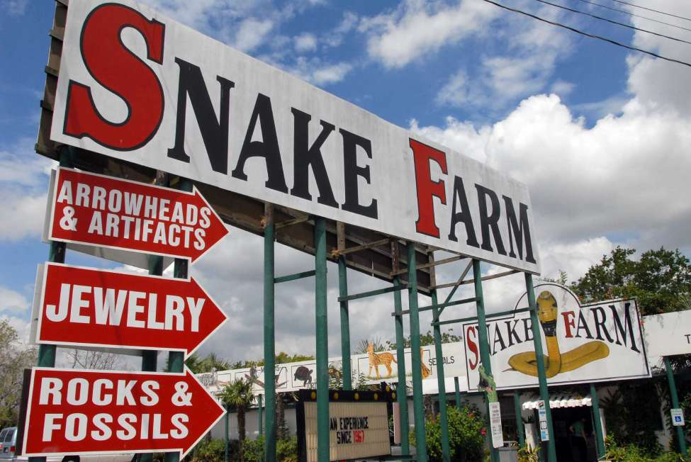

# snekfarm

A Battlesnake API server with some snakes.

# Develop
`nix-shell` in this directory to launch into a Go development environment (Go,
GOPATH, etc).

# Deploy
`./deploy.sh` to build and deploy this service. Docker must be installed on the TARGET host.

# Meet the sneks

## lucky

lucky lives at http://snekfarm.cmars.tech/lucky.

See the [package documentation](https://pkg.go.dev/github.com/cmars/snekfarm/lucky) for more about lucky.

